# NEXRAD Workbench — Architecture in Diagrams

A visual, diagram-first companion to [ARCHITECTURE.md](../ARCHITECTURE.md). The
prose doc is the canonical *engineering map* (every file and its purpose); this
doc shows **how the pieces relate structurally** and **how data flows at
runtime**. Diagrams are Mermaid (rendered inline by GitHub and most Markdown
viewers).

Deep dives live in the subsystem references — this doc links into them rather
than duplicating them:
[CORE_SHELL.md](CORE_SHELL.md) (the architecture standard),
[RENDERING.md](RENDERING.md) (GPU pipeline + 3D),
[STREAMING.md](STREAMING.md) (live sequencing),
[TIMING.md](TIMING.md) (the three time categories),
[INDEXEDDB.md](INDEXEDDB.md) (cache schema).

**Reading order:** §1 context → §2 threading model → §3 the architecture
standard → §4 module map → §5 state ownership → §6 the frame loop → §7–10 the
runtime pipelines → §11–13 the leaf subsystems (storage / GPU / UI).

---

## 1. System Context

NEXRAD Workbench is a **100% client-side** Rust→WASM application. There is no
backend of our own; the browser talks directly to public data services.

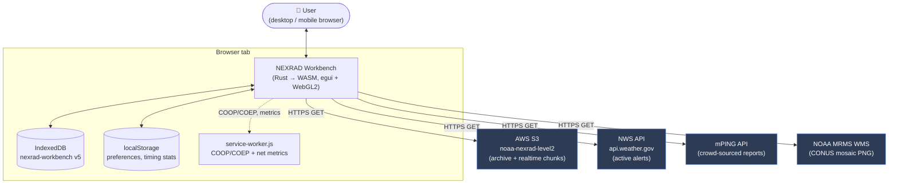

| External service | Used for | Code |
|---|---|---|
| **AWS S3** (`noaa-nexrad-level2`) | Archive volume scans + realtime chunk stream | `nexrad::download`, `nexrad::realtime` |
| **NWS** (`api.weather.gov`) | Active severe-weather alert polygons | `alerts/` |
| **mPING** | Crowd-sourced ground-truth precip reports | `mping/` |
| **NOAA MRMS WMS** | CONUS composite reflectivity overlay | `nexrad::national_mosaic` |

Everything else — decode, projection, rendering, caching — happens locally.
Cross-origin isolation (COOP/COEP via the service worker) unlocks
`SharedArrayBuffer`; the app degrades gracefully if it's unavailable.

---

## 2. Threading Model — Thin Shell + Fat Worker

The single most important structural fact: **the main thread is a thin UI shell;
all heavy data work runs in a pool of Web Workers.** They communicate by
`postMessage` with *Transferable* `ArrayBuffer`s (zero-copy).

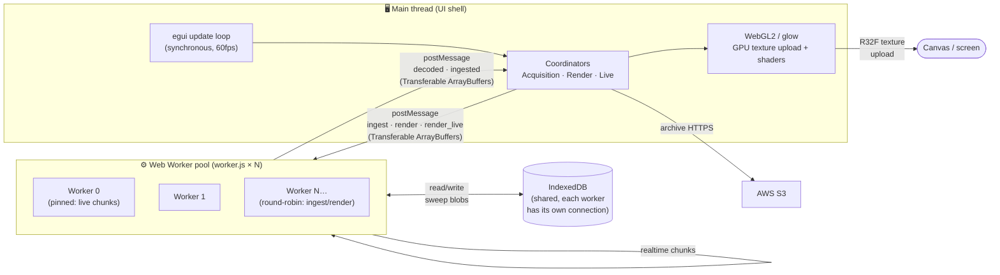

What runs where:

| Main thread (shell) | Worker pool (fat) |
|---|---|
| egui panels, canvas painting, input | bzip2 decompress, NEXRAD decode |
| Coordinators + channel polling | sweep extraction → pre-computed blobs |
| **GPU** texture upload + shader passes | **IndexedDB** blob I/O |
| Archive S3 download (async channel) | live-chunk accumulation (`CHUNK_ACCUM`) |
| dedup / prefetch *decisions* (pure) | marshaling raw gates for GPU upload |

**Pool sizing & dispatch** (`nexrad::decode_worker::pool`):
`default_pool_size() = clamp(hw_concurrency − 1, 1..=4)`.
- `ingest`, `render`, `render_volume` → **round-robin** (each worker has its own
  IDB connection, so parallel decompress fans out across cores).
- `ingest_chunk`, `render_live` → **pinned to worker 0** — the live accumulator
  is a thread-local (`CHUNK_ACCUM`) that must stay consistent across a volume's
  chunks.

Each worker correlates requests by id via per-worker `pending_*` maps; the main
thread drains all workers each frame with `WorkerPool::try_recv() -> Vec<WorkerOutcome>`.

---

## 3. The Architecture Standard — Functional Core, Thin Shell

This is the **binding rule** for all code (full reference:
[CORE_SHELL.md](CORE_SHELL.md)). Three layers; only two things ever cross the
boundary: **intents in, view-model out** (effects are *described* by the core and
*executed* by the shell).

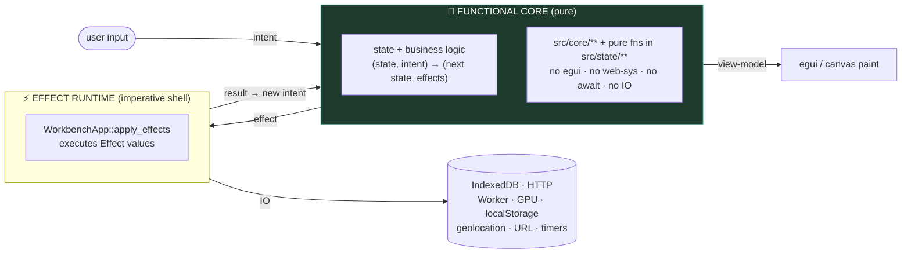

The test recipe is the whole point — **a feature test never touches a browser:**

```rust
let mut core = Core::new(/* fixture */);
let effects = core.handle(Intent::SeekTo(ts));            // send an intent
assert_eq!(core.view_model().displayed_frame_ts, ts);     // assert the projection
assert!(effects.contains(&Effect::RenderSweep { .. }));   // assert the IO it ASKED for
// the effect is NOT executed — we assert the DECISION, not the side effect
```

### The four seams in this codebase

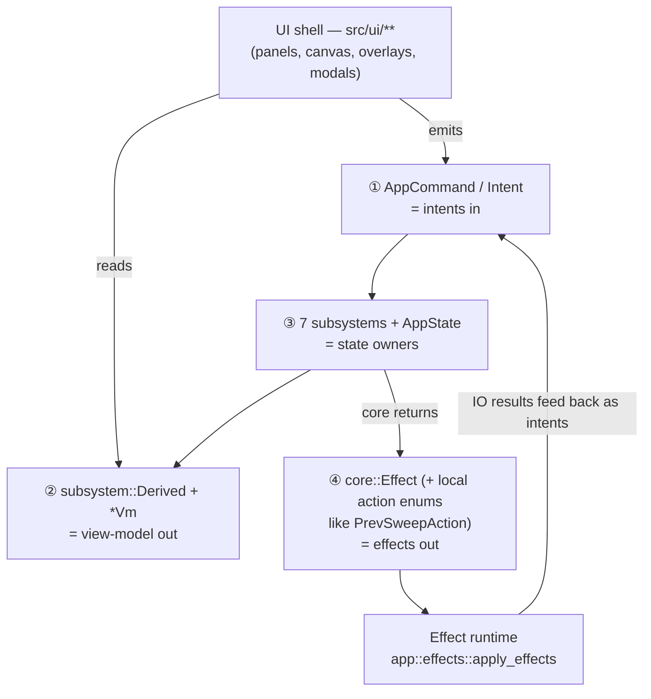

| Seam | Role | Where |
|---|---|---|
| `AppCommand` (→ `Intent`) | intents in | `state::AppCommand`, `core::intent` |
| `subsystem::Derived` + `*Vm` | view-model out | `subsystem::derived`, `core::diagnostics::DiagnosticsVm` |
| 7 subsystems + `AppState` | state owners | `subsystem/**`, `state/**` |
| `core::Effect` + local action enums | effects out | `core::effect`, `core::playback_manager::PrevSweepAction` |

**Migration status:** P0–P4 + P6 complete, P5 partial (pure logic extracted; the
broad interactive `&mut`→intent rewrite is QA-gated). Carve-outs: GPU paint is
irreducibly shell; camera/projection math is already pure; `realtime/streaming.rs`
is de-scoped. See [CORE_SHELL.md](CORE_SHELL.md) for the per-phase detail.

---

## 4. Module Map

The crate is layered top-down: the **shell** orchestrates, the **UI** projects,
**subsystems** own state, the **core** decides (pure), **domain/services**
implement features, and **foundation** is the leaf.

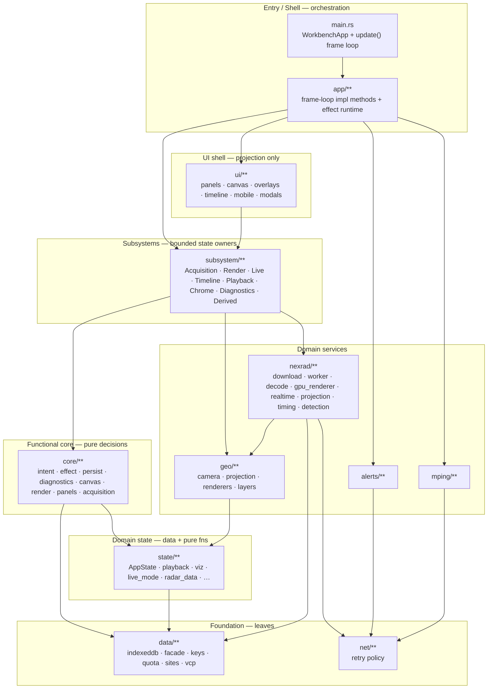

| Module | Responsibility |
|---|---|
| `main.rs` / `app/**` | App entry, `update()` frame loop, effect runtime, frame-loop methods |
| `ui/**` | egui panels, canvas + overlays, timeline, mobile chrome, modals — *projection + intents only* |
| `subsystem/**` | 7 bounded contexts that own a coherent slice of state + a typed API |
| `core/**` | Pure decision functions: the home of the architecture contract |
| `state/**` | `AppState` data tree + already-pure decision helpers (~533 tests live here) |
| `nexrad/**` | The data pipeline: acquire → worker → decode → cache → render + 3D + timing + detection |
| `geo/**` | Camera, projection, geographic feature + globe rendering |
| `data/**` | IndexedDB, sweep storage facade, key types, quota, site/VCP tables |
| `alerts/**`, `mping/**`, `net/**` | NWS alerts, mPING reports, shared HTTP retry policy |

---

## 5. State Ownership

`WorkbenchApp` is a thin coordinator. State is split across **`AppState`** (the
shared data tree) and **7 subsystems** (bounded contexts), plus the GPU resources
and a few shell-only fields.

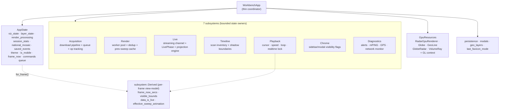

**Per-frame view-model.** `Derived::for_frame(&state, &playback)` is computed once
near the top of the frame and once before panels render, so every UI consumer
reads identical values (no intra-frame drift). It carries the small set of
cross-cutting facts panels need: `frame_now_secs`, `visible_bounds`,
`data_is_live`, `effective_sweep_animation`. Richer per-feature view-models
(e.g. `DiagnosticsVm`) are built the same way.

**`AppMode`** (`Idle` / `Archive` / `Live`) is *derived* each frame from live
state and drives the favicon color + title prefix.

---

## 6. The Per-Frame Update Loop

`WorkbenchApp::update()` runs ~60×/sec. The order is **load-bearing** — comments
in `main.rs` flag the invariants. Stages group into six phases:

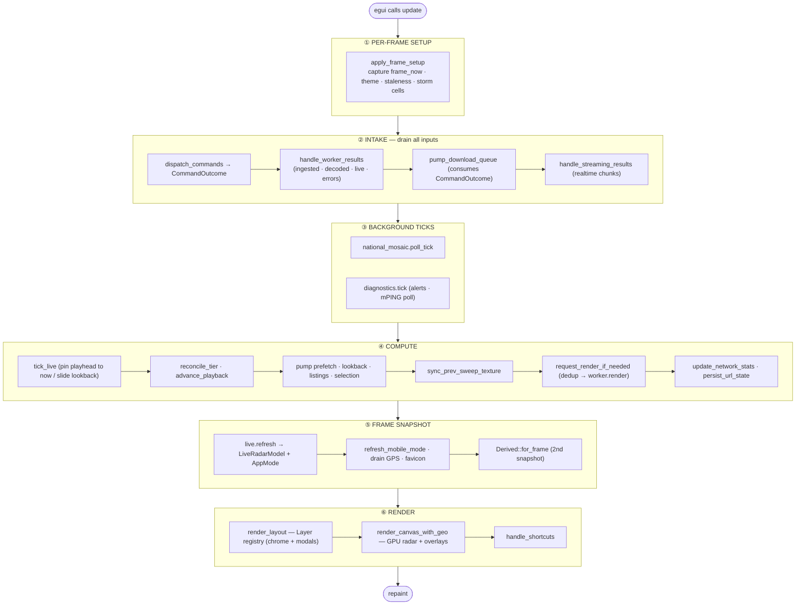

**Why the order matters (key invariants):**
- ② `dispatch_commands` precedes `pump_download_queue` (the pump consumes its
  `CommandOutcome`); the pump waits until *after* `handle_worker_results` so
  newly-decoded sweeps are visible before download decisions.
- ④ `advance_playback` precedes `request_render_if_needed` so a new playhead
  position triggers a render *the same frame* (no one-frame lag).
- ⑤ snapshots (`live.refresh`, `Derived::for_frame`) run before ⑥ panels read
  them.
- ⑥ side/top/bottom panels render before the CentralPanel canvas (egui layout
  requirement); modals layer last.

---

## 7. The Core Data Pipeline — Acquire → Ingest → Render → Display

The canonical archive path. Note the **pre-computation trick**: sweep blobs are
built once at ingest and stored GPU-ready, so later renders (scrub, elevation
change) are near-zero-cost reads.

```mermaid
flowchart LR
    subgraph acquire["ACQUIRE (main + S3)"]
        sel["user picks site/scan<br/>(or range selection)"]
        dq["DownloadQueueManager<br/>enqueue → advance"]
        dl["DownloadChannel<br/>S3 GET"]
        sel --> dq --> dl
    end
    subgraph ingest["INGEST (worker, round-robin)"]
        sp["split LDM records"]
        dc["decompress (bzip2) + decode"]
        gr["group radials by elevation"]
        vcp["extract VCP (msg type 5)"]
        blob["build PrecomputedSweep blobs<br/>(per elevation × product)"]
        sp --> dc --> gr --> vcp --> blob
    end
    store[("IndexedDB<br/>sweeps · scan_index · scan_touches")]
    subgraph render["RENDER (worker, dedup)"]
        ded["RenderCoordinator<br/>should_dispatch dedup"]
        rd["worker_render:<br/>read 1 blob → marshal<br/>Float32Array (zero-copy)"]
        ded --> rd
    end
    subgraph display["DISPLAY (main, GPU)"]
        up["upload raw gates → R32F texture"]
        sh["fragment shader:<br/>polar→Cartesian + raw→physical + LUT"]
        up --> sh
    end

    dl -->|"DownloadResult bytes"| sp
    blob -->|"store_sweeps"| store
    blob -.->|"metadata back"| ded
    store -->|"get_sweep"| rd
    rd -->|"Transferable buffer"| up
    sh --> px([radar disc on canvas])
```

Two acquisition triggers feed the same queue:
- **Explicit** — user taps a scan (`FetchScan`) or finalizes a timeline range.
- **Reactive** — `pump_implicit_prefetch` fetches scans near the playhead
  (debounced so scrub/zoom transients don't download); `pump_visible_listings`
  keeps S3 listings (→ timeline "shadow" boundaries) populated for the visible
  date range.

---

## 8. Sequence — Archive Download & First Render

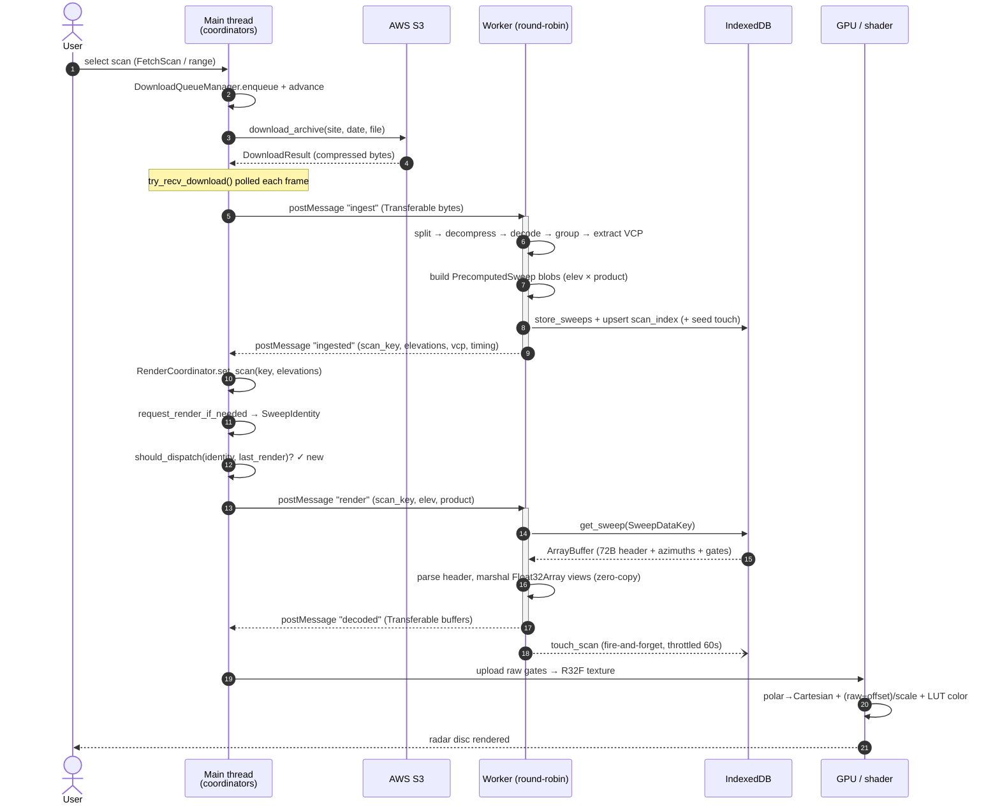

---

## 9. Sequence — Scrub / Elevation / Product Change (the fast path)

The whole reason for pre-computed blobs: changing the playhead, elevation, or
product **never re-decodes** — it's a dedup check, a single IDB read, and a GPU
upload. The pure `should_dispatch` gate suppresses redundant requests.

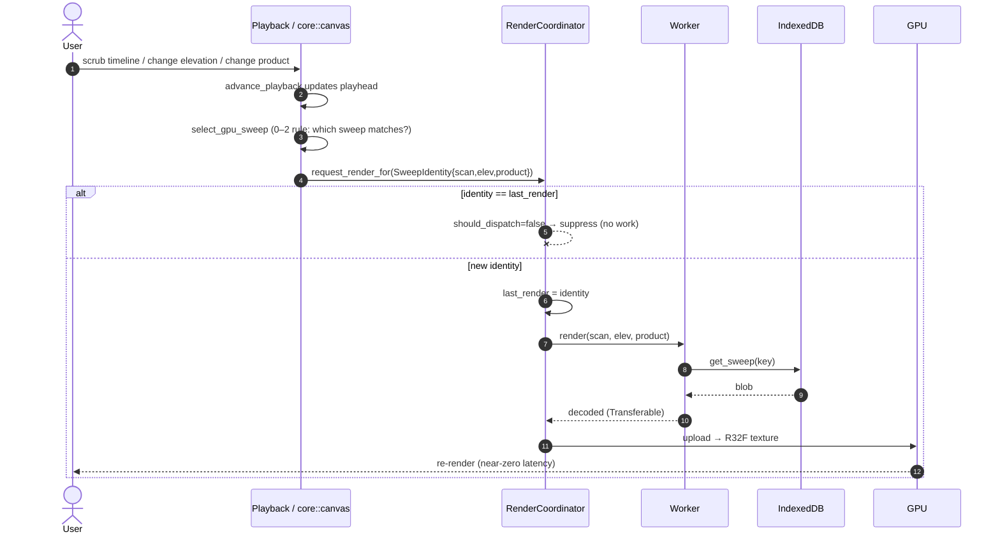

---

## 10. Live Streaming

### 10a. LivePhase state machine

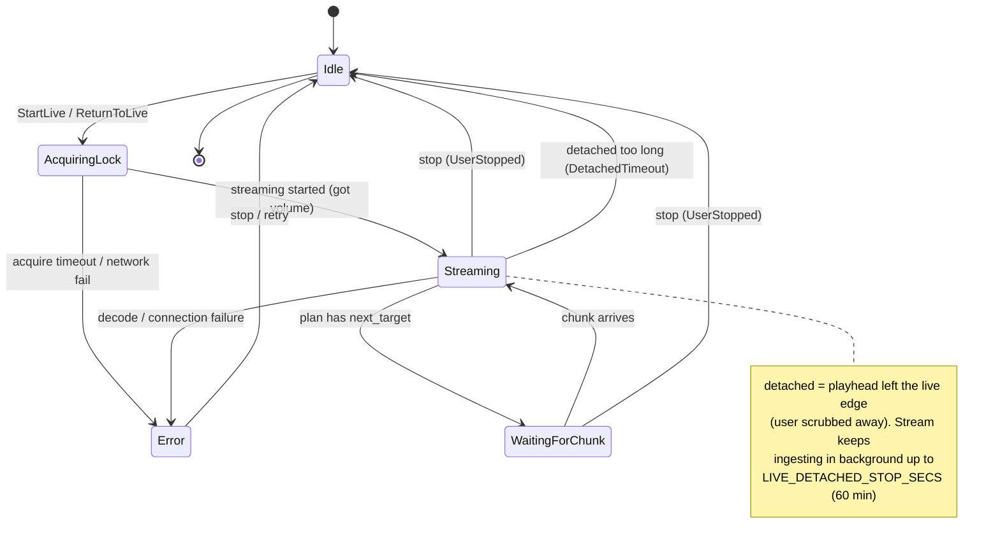

### 10b. Streaming pipeline sequence

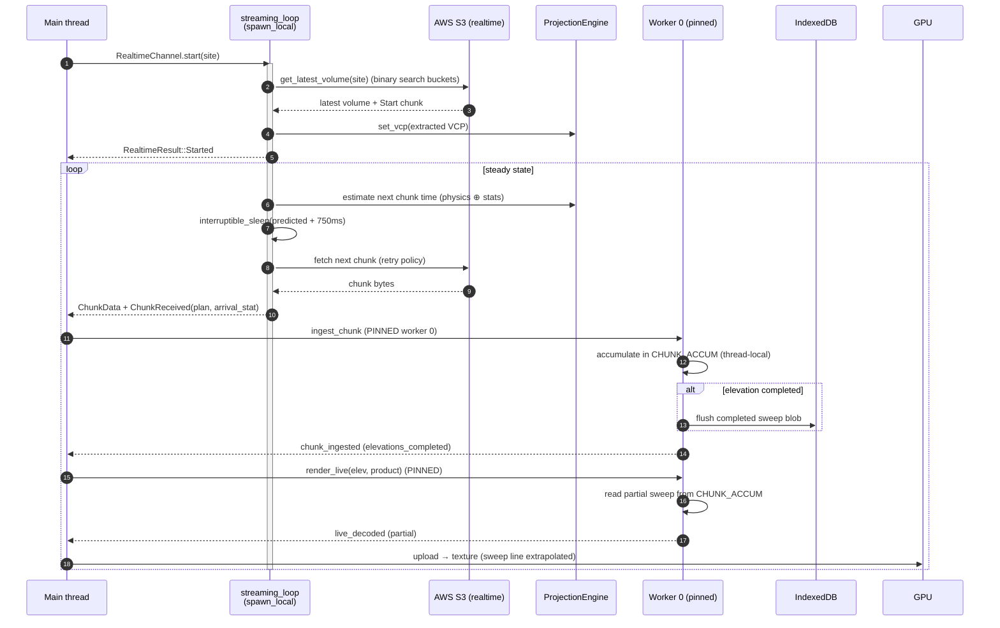

### 10c. The three time categories

The timing model (`nexrad::timing`, `nexrad::projection`) reconciles three
different clocks so the timeline can show *where the radar is now* and *when the
next sweep will appear* before it exists. Full detail in [TIMING.md](TIMING.md).

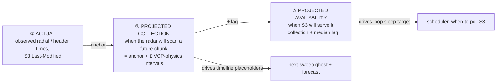

`ProjectionEngine` is the single owner of projection inputs (VCP, filter,
collection anchor, availability samples, S3 listings, cached sweeps). It memoizes
a `Projection { plan: StreamingPlan, live_scan: ScanProjection }`, invalidated by
an `input_revision` counter. `subsystem::Live` clones the frame's projection into
`LiveRadarModel` so the canvas, timeline, and panels all read one consistent
snapshot.

---

## 11. Storage — IndexedDB

Database `nexrad-workbench` v5, three string-keyed object stores. Schema upgrades
are destructive. Full byte formats + concurrency model in
[INDEXEDDB.md](INDEXEDDB.md).

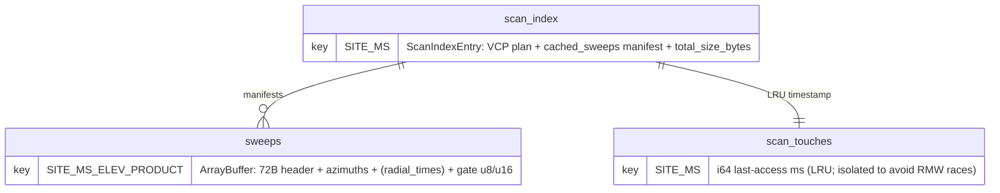

| Store | Key format | Role |
|---|---|---|
| **`sweeps`** | `SITE\|MS\|ELEV\|PRODUCT` | **Primary render path** — GPU-ready blob |
| `scan_index` | `SITE\|MS` | Per-scan plan + realized-sweep manifest (fast timeline queries) |
| `scan_touches` | `SITE\|MS` | LRU last-access (isolated so fire-and-forget touches don't race index writes) |

### The transaction rule (WASM-critical)

In WASM, an IDB transaction **auto-commits when the event loop yields** — so any
`.await` inside a `readwrite` transaction silently voids it. Enforced
*type-level*: the write closure is a synchronous `FnOnce` (not `async`), and the
`.await` happens only *after* it returns.

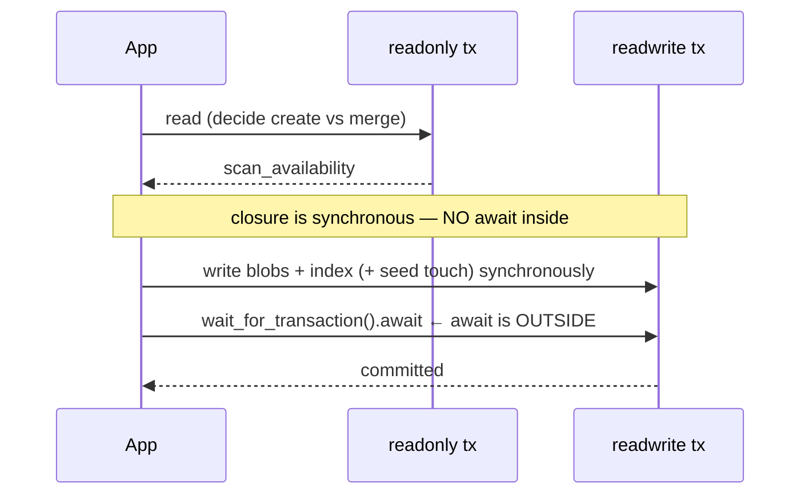

Concurrent same-scan upserts are rejected at runtime by an `UpsertScanGuard` RAII
token (`DataError::ConcurrentUpsert`).

### Cache eviction (LRU)

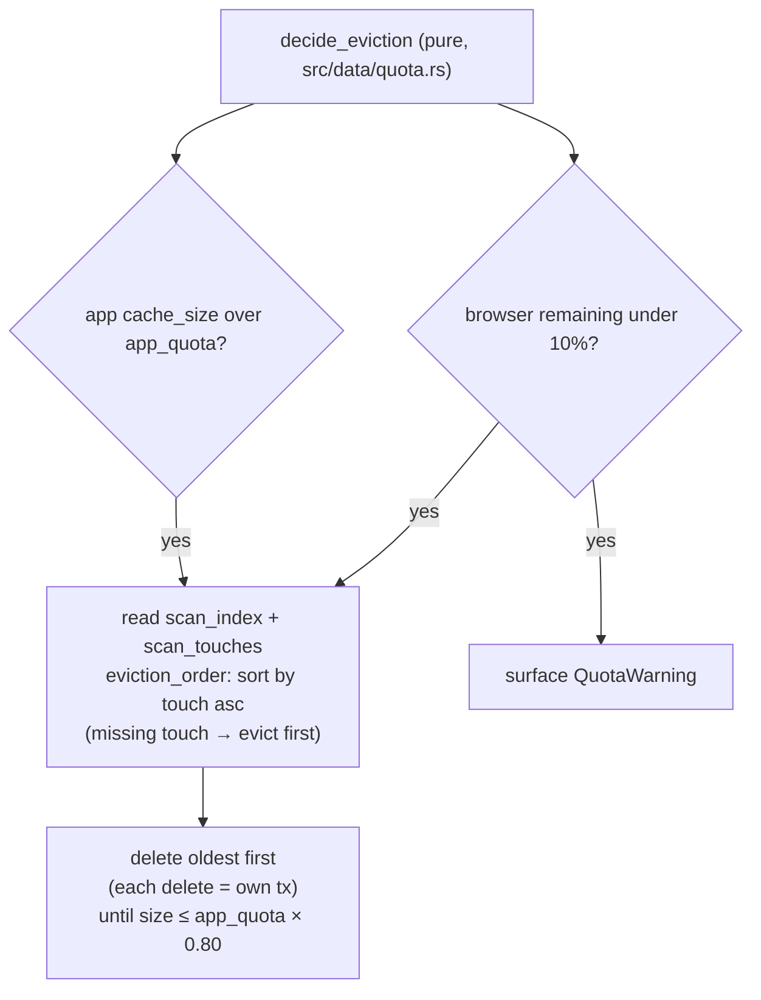

The pure decision functions in `data::indexeddb::logic` —
`should_skip_touch`, `decide_quota`, `eviction_order`,
`filter_scans_by_time_window` — are unit-tested with no real IDB; `DataFacade`
(cloneable, shares one connection) wraps the imperative store.

---

## 12. GPU Render Pipeline & Camera

### 12a. Raw-gate shader pipeline

Gate values are uploaded **raw** (u8/u16 as float); the *fragment shader* does
polar→Cartesian, raw→physical, and color lookup per pixel. Because the
`(raw−offset)/scale` transform is linear, bilinear interpolation works correctly
on raw values, and the sentinels (0 = below-threshold, 1 = range-folded) survive
as a `v > 1.5` validity test. Detail in [RENDERING.md](RENDERING.md).

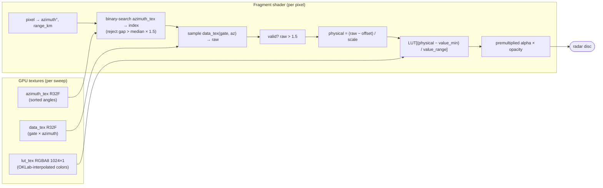

Key uniforms: `offset`, `scale` (per-product), `value_min`/`value_range` (LUT
window), `interpolation` (0 nearest / 1 bilinear), `opacity`,
`data_age_desaturation`, plus the sweep-animation set (`sweep_enabled`,
`sweep_azimuth`, …) and a duplicate set for the **previous** sweep so the shader
can crossfade between them per pixel.

### 12b. Camera state machine & the 2D/3D split

The camera is an **enum** — exactly one variant is active, and `ViewMode` is
*derived* from it (no separate toggle to keep in sync).

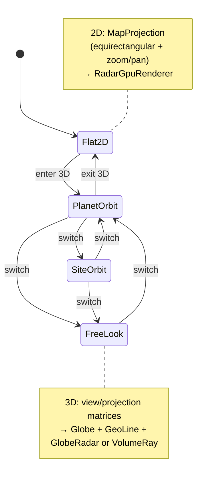

Which renderers are active depends on view mode (and, in 3D, the volume toggle):

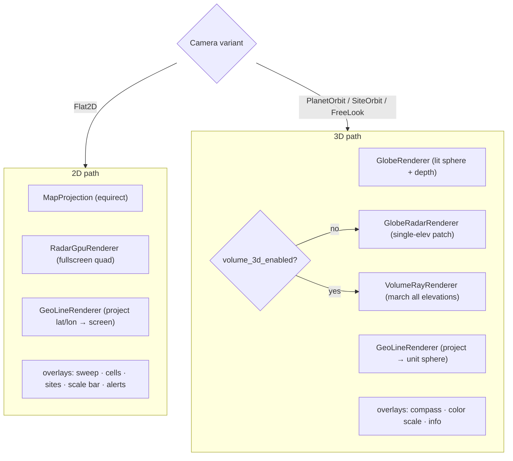

Both paths share the same GPU textures (data / lut / azimuth) and the same GLSL
snippet blocks, so 2D and 3D radar can't drift. Geographic layers (states,
counties, cities) are **embedded shapefiles** loaded at compile time; storm-cell
detection (`nexrad::detection`) runs connected-component analysis on reflectivity
and is pure/testable (core), with only the box-drawing in the shell.

---

## 13. UI Shell — Layout Registry & Canvas Overlays

The chrome is a **declarative `Layer` registry**, not hand-ordered calls. Each
`Layer` declares its `kind` (Chrome vs Modal), `z_order`, and a `visible()`
predicate; `render_layout` walks the slice in z-order. Desktop and mobile swap
the chrome set but share the modal set.

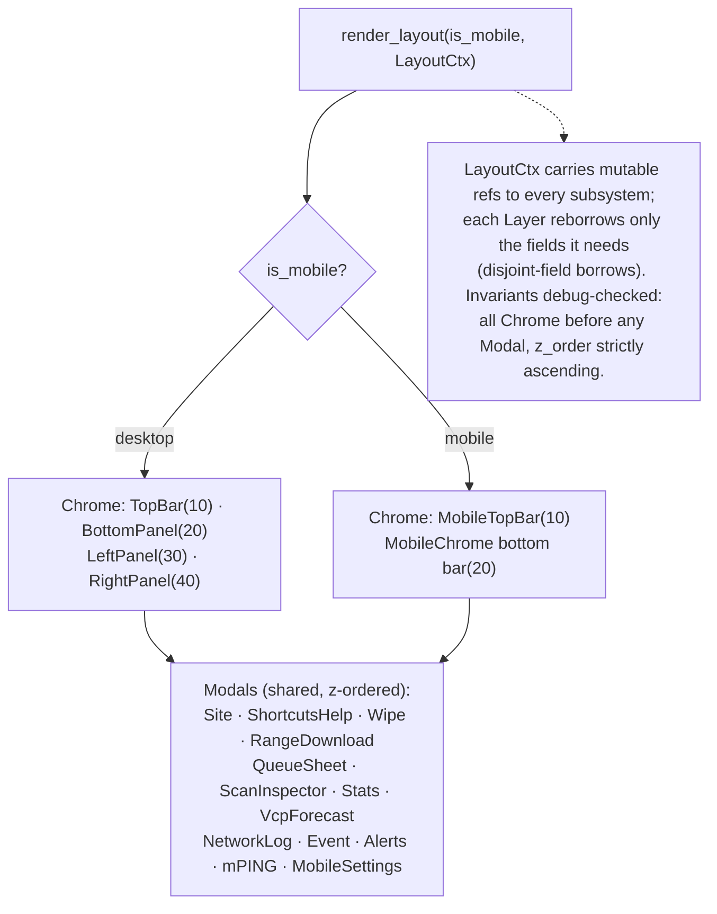

The **canvas** (`render_canvas_with_geo`) is called directly (not via the Layer
registry) because it owns `geo_layers` + `GpuResources`. Overlays paint in a
fixed order:

```mermaid
flowchart TB
    c0["1 National mosaic (CONUS composite, site cutout)"]
    c1["2 Geo layers — Lines pass (states · counties · lakes · highways)"]
    c2["3 Radar texture (GPU sweep)"]
    c3["4 Geo layers — Labels pass + alert polygons (2D)"]
    c4["5 mPING reports · GPS marker · sites"]
    c5["6 Sweep animation (prev↔current crossfade) · storm cells"]
    c6["7 Inspector probe · distance tool"]
    c7["8 Corner chrome (Overlay trait): info · color scale · compass(3D) · scale bar(2D)"]
    c0 --> c1 --> c2 --> c3 --> c4 --> c5 --> c6 --> c7
```

**Input → intents.** `canvas_interaction` translates pan/zoom/click/pinch into
state changes or `AppCommand`s (e.g. clicking a site → open site modal; clicking
an mPING report → focus it; a mobile reveal-tap is swallowed instead of panning).
Per the standard, decision math (hit-tests, geometry) lives in the core; the
shell just emits intents and projects the view-model.

---

## 14. Async / Channel Bridge

egui's `update()` is synchronous, but acquisition, streaming, IDB, and
geolocation are async. The bridge is uniform: **spawn an async task that posts to
an `mpsc` channel; poll the channel every frame.**

```mermaid
sequenceDiagram
    participant F as update() frame N
    participant Ch as mpsc channel
    participant T as spawn_local task
    participant Ext as S3 / IDB / worker / geo

    F->>T: start_operation(ctx, params)
    activate T
    T->>Ext: await IO
    Note over F: frames N+1, N+2 … keep rendering
    Ext-->>T: result
    T->>Ch: send(result)
    T->>F: ctx.request_repaint()
    deactivate T
    loop every frame
        F->>Ch: try_recv()
        Ch-->>F: Some(result) → handle
    end
```

Spawning is platform-gated: WASM uses `wasm_bindgen_futures::spawn_local`; the
native dev stub uses `std::thread::spawn` + `pollster::block_on`. Coordinators
(`AcquisitionCoordinator`, `RealtimeChannel`, `CacheLoadChannel`,
`NetworkMonitor`) each own their channels and expose a `try_recv` drained in the
frame loop's INTAKE phase.

---

## Appendix — Key Types at a Glance

| Type | Module | Role |
|---|---|---|
| `WorkbenchApp` | `main.rs` | Thin coordinator; owns subsystems + GPU + the frame loop |
| `AppState` | `state` | Shared data tree + command queue |
| `AppCommand` / `Intent` | `state` / `core::intent` | The intent vocabulary (UI → loop) |
| `Effect` | `core::effect` | Described side effect the shell executes |
| `subsystem::Derived` | `subsystem::derived` | Per-frame cross-cutting view-model |
| `ScanKey` | `data::keys` | `SITE\|MS` — volume identity |
| `SweepDataKey` | `data::keys` | `SITE\|MS\|ELEV\|PRODUCT` — sweep blob identity |
| `PrecomputedSweep` | `data::keys` | GPU-ready blob (header + azimuths + gates) |
| `SweepIdentity` | `state::viz` | Render dedup key (scan + elev + product) |
| `RenderCoordinator` | `nexrad` | Worker pool + `should_dispatch` dedup |
| `AcquisitionCoordinator` | `nexrad` | Download channel + queue + archive index + facade |
| `ProjectionEngine` | `nexrad::projection` | Owns live timing projection inputs/outputs |
| `LiveModeState` / `LivePhase` | `state::live_mode` | Live streaming state machine |
| `DataFacade` / `IndexedDbStore` | `data` | Cache layer (cloneable, shared connection) |
| `RadarGpuRenderer` | `nexrad::gpu_renderer` | WebGL2 polar→Cartesian + raw→physical shader |
| `Camera` | `geo::camera` | Enum state machine (Flat2D / PlanetOrbit / SiteOrbit / FreeLook) |

---

*Generated 2026-06-15 from the `functional-core-migration` branch. Keep diagrams
in sync with [ARCHITECTURE.md](../ARCHITECTURE.md) when subsystems change; the
prose doc remains the authoritative file-by-file map.*
</content>
</invoke>
